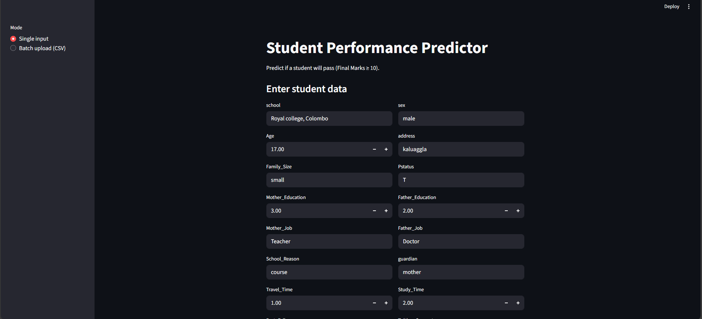

# Student Performance Predictor

Predict if a student will pass (Final Marks ≥ 10) using a **Random Forest Classifier** with a **Streamlit Web App**.

---

## Features

- Predict pass/fail for **single student input** or **batch CSV upload**.
- Shows **pass probability**.
- Displays **top 10 feature importances**.
- Friendly for Sri Lanka context with intuitive column names.
- Easy CSV upload for batch predictions.

---
## Screenshots

### Single Student Input


### Batch CSV Upload


## Installation

1. Clone this repository:

```bash
git clone https://github.com/Subhaga2000/student-performance-predictor.git
cd student-performance-predictor


